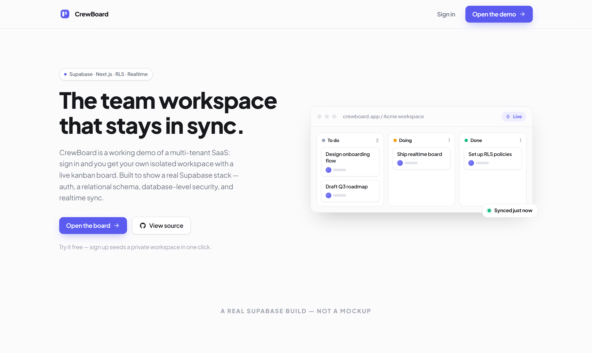
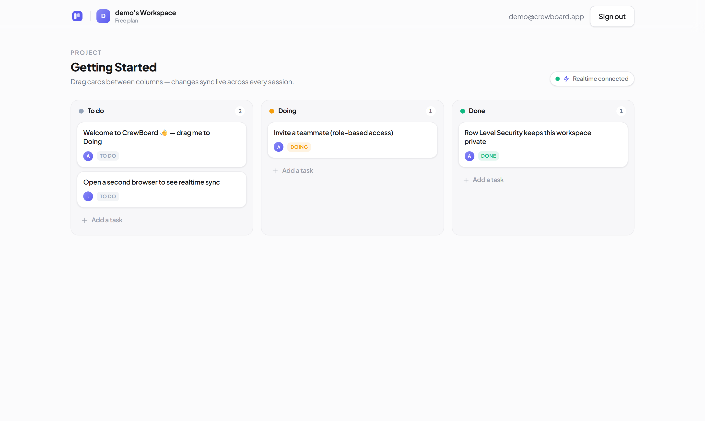

# CrewBoard

**A multi-tenant team task board — a real Supabase SaaS, built end-to-end.**

CrewBoard is a working demo of a production-grade SaaS: sign in and you get your
own **isolated workspace** with a **live kanban board** that syncs in real time.
It exists to show the parts that actually matter in a Supabase app — auth, a
relational schema, database-level security, and realtime — done properly.

**▶ Live demo: https://crewboard-ciel-vins-projects.vercel.app**
Demo login (or click *“Use demo account”*): `demo@crewboard.app` · `crewboard123`

`Next.js 14` · `TypeScript` · `Supabase (Auth · Postgres · RLS · Realtime)` · `Tailwind` · `Framer Motion`



---

## What this demonstrates

| Capability | How it's implemented |
|---|---|
| **Supabase Auth** | Email + password with cookie-based SSR sessions (`@supabase/ssr`) and route protection in Next.js middleware. |
| **Relational Postgres** | A real schema — `organizations → members → projects → tasks → comments` — with foreign keys and cascade deletes. |
| **Row Level Security** | Every table is RLS-protected. A user can only ever read/write rows in organizations they belong to — enforced **at the database**, not in the UI. |
| **Realtime** | The board subscribes to Postgres changes, so moving a card in one session updates every other session instantly. |
| **Role-based access** | `owner / admin / member` roles gate who can manage projects and members. |
| **Zero-friction onboarding** | A signup trigger auto-seeds each new user a private workspace with a starter board. |



---

## Architecture

### Data model
```
organizations ──< members >── auth.users
      │
      └──< projects ──< tasks ──< comments
```

### Row Level Security (the core of multi-tenancy)
Isolation is guaranteed by the database. `SECURITY DEFINER` helper functions
(e.g. `is_member(org)`) avoid policy recursion, and every policy checks
membership:

```sql
-- a user only sees tasks that belong to a project in one of their orgs
create policy task_select on tasks for select
  using ( is_member( org_of_project(project_id) ) );
```

Open the app in two browsers with **two different accounts** and you'll see each
workspace is completely invisible to the other — that's RLS, not a client-side
filter. Full schema + policies: [`supabase/migrations/0001_init.sql`](./supabase/migrations/0001_init.sql).

### Realtime
The board channel listens to `postgres_changes` on `tasks` (scoped by project);
inserts, moves and deletes propagate to every connected client, RLS-scoped.

---

## Tech stack
- **Framework:** Next.js 14 (App Router, Server Components, Server Actions)
- **Language:** TypeScript
- **Backend:** Supabase — Postgres, Auth, Row Level Security, Realtime
- **Styling / motion:** Tailwind CSS, Framer Motion
- **Hosting:** Vercel (frontend) + Supabase (managed Postgres)

## Project structure
```
app/            routes — landing, /login, protected /app workspace
components/     Board (realtime kanban), UI, icons, motion primitives
lib/supabase/   browser + server (SSR) Supabase clients
middleware.ts   session refresh + /app route guard
supabase/migrations/0001_init.sql   schema · RLS · realtime · seed trigger
```

## Run it locally
```bash
# 1. Create a free Supabase project, then run the SQL migration
#    (supabase/migrations/0001_init.sql) in the Supabase SQL editor.
# 2. Add credentials:
cp .env.local.example .env.local     # fill NEXT_PUBLIC_SUPABASE_URL + ANON_KEY
# 3. Start:
npm install
npm run dev                          # http://localhost:3000
```

---

Built by **Alvin Salim** — full-stack developer (Next.js · Supabase · Laravel).
Portfolio: [portfolio-plum-eight-23.vercel.app](https://portfolio-plum-eight-23.vercel.app) · GitHub: [@ciel-vin](https://github.com/ciel-vin)
